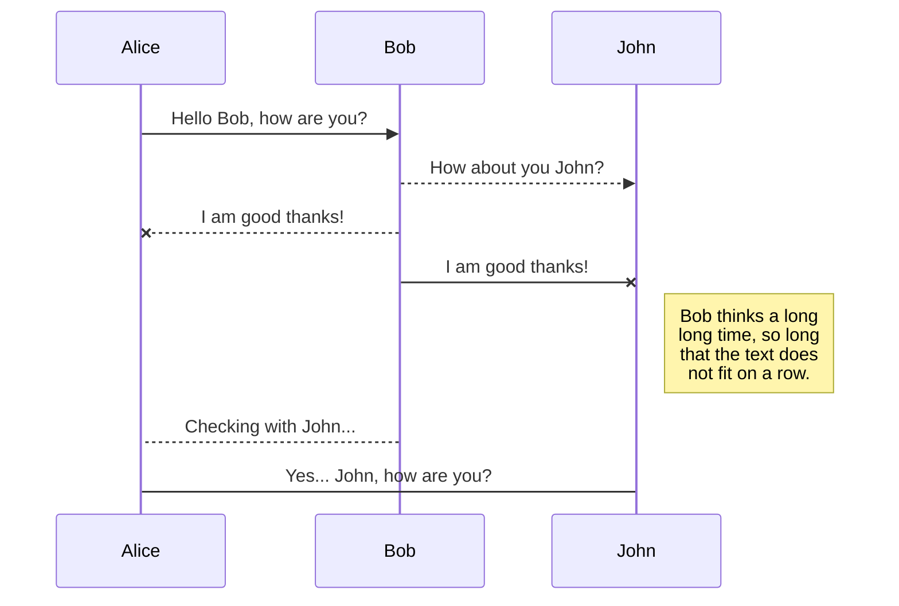
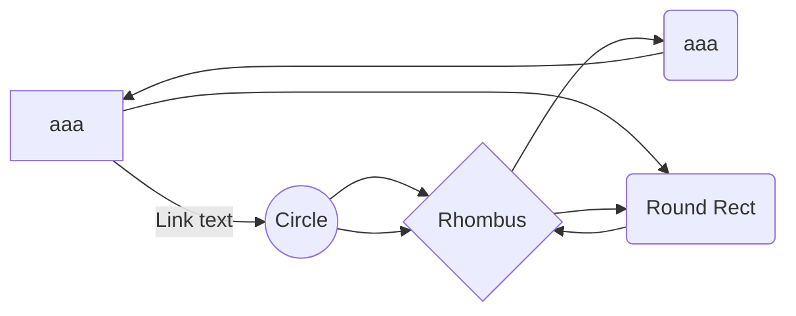

> Written with [StackEdit](https://stackedit.io/).

## header 1
### header 2

* list 1
* list 2
* list 3

|                |ASCII                          |HTML                         |
|----------------|-------------------------------|-----------------------------|
|Single backticks|`'Isn't this fun?'`            |'Isn't this fun?'            |
|Quotes          |`"Isn't this fun?"`            |"Isn't this fun?"            |
|Dashes          |`-- is en-dash, --- is em-dash`|-- is en-dash, --- is em-dash|

normal paragraph. more stuff here.

## header 2

* list2 
* list23
* list44

You can render LaTeX mathematical expressions using [KaTeX](https://khan.github.io/KaTeX/):

The *Gamma function* satisfying $\Gamma(n) = (n-1)!\quad\forall n\in\mathbb N$ is via the Euler integral

$$
\Gamma(z) = \int_0^\infty t^{z-1}e^{-t}dt\,.
$$

> You can find more information about **LaTeX** mathematical expressions [here](http://meta.math.stackexchange.com/questions/5020/mathjax-basic-tutorial-and-quick-reference).

 [Mermaid](https://mermaidjs.github.io/)
 

<!--stackedit_data:
eyJoaXN0b3J5IjpbLTE2NDY3ODI4MDUsNTIwMDY0NzM5LC0xMz
EyNjYxOTU3LC03Njg5MDM5MzAsMTg2NjUxODE5XX0=
-->