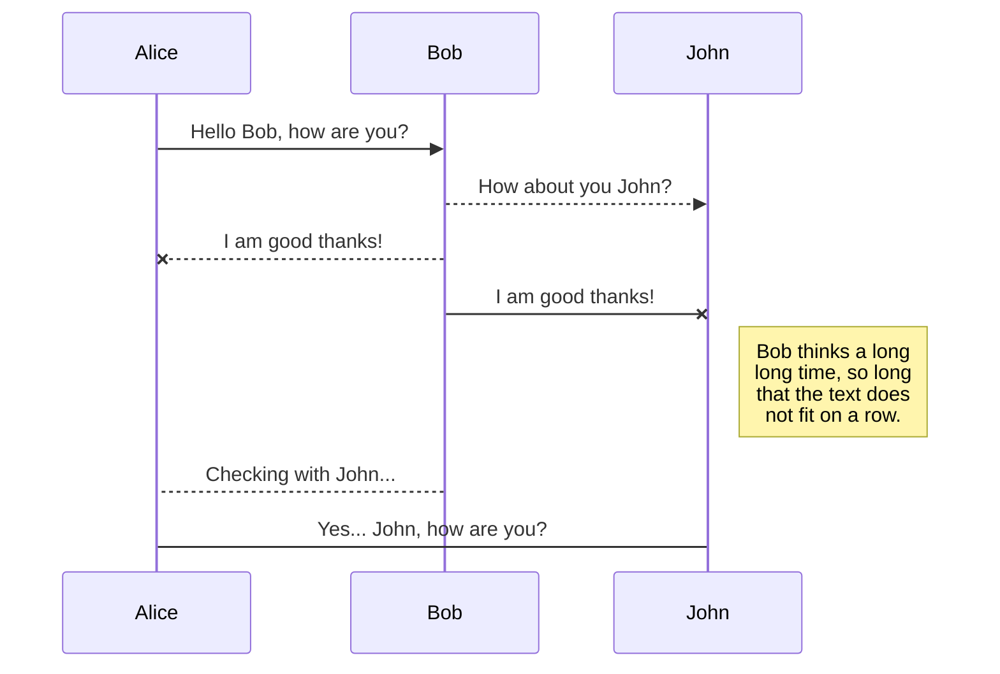
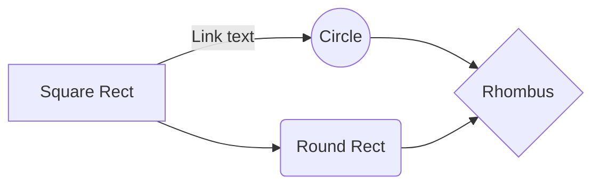

> Written with [StackEdit](https://stackedit.io/).

## header 1
### header 2

* list 1
* list 2
* list 3

normal paragraph. more stuff here.

## header 2

* list2 
* list23
* list44

<!--stackedit_data:
eyJoaXN0b3J5IjpbLTE5ODA5MTc2NzksLTc2ODkwMzkzMCwxOD
Y2NTE4MTldfQ==
-->